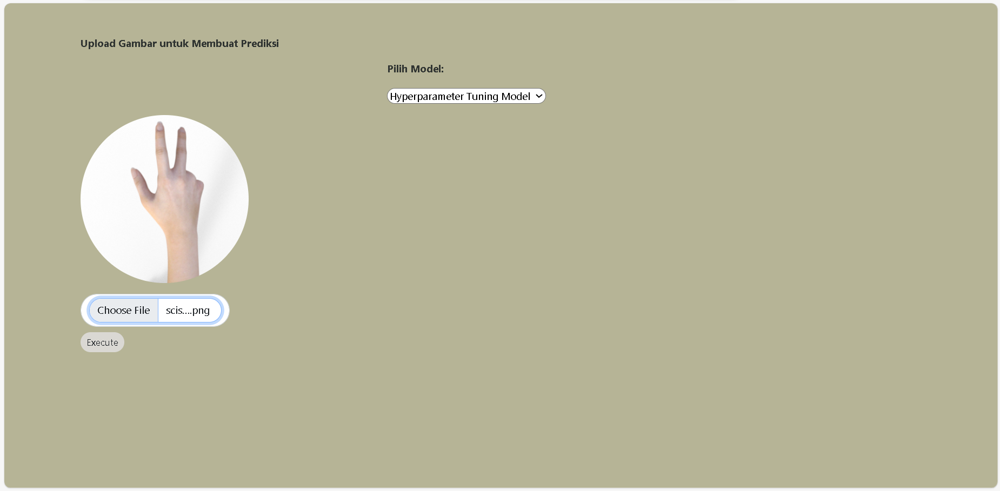
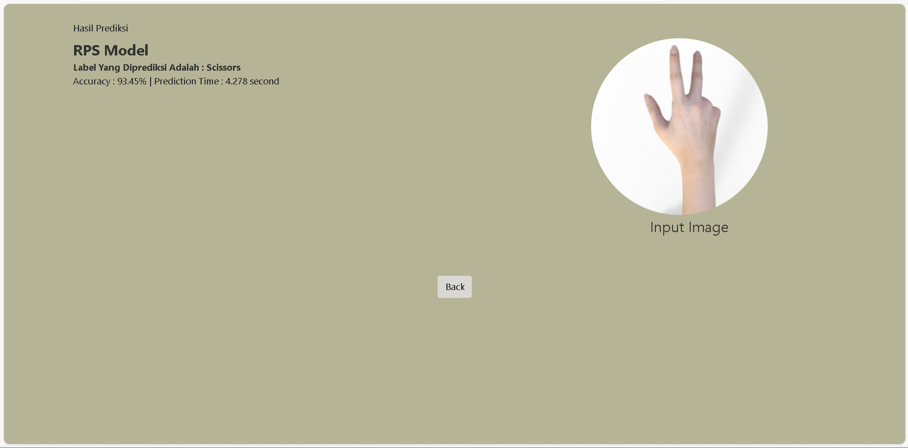

# **Praktikum Machine Learning - Modul 6**

## Overview Dataset

Link Dataset yang digunakan [Klik disini](https://drive.google.com/drive/folders/1h-8wJMq_bLZSJT0OxXpnYVPcyRQnstkX?usp=sharing) Gambar yang digunakan adlah RPS image **(Rock, Paper, Scissors)** dengan total 2520 gambar. Yang terdiri dari 840 gambar Paper, 840 gambar Rock, dan 840 gambar Scissors. 

Splitting Dataset : Training = 70%, Validation = 20%, Testing = 10%

## Installation

* **Environment - path** : 3.9.12
* **VSCode** : `pip install flask` `pip install tensorflow` `pip install pillow` `pip install opencv-2 pip list python`
* **Install Requirements** : `pip install -r requirements`
* Lalu jalankan flask python : `App.py`

Project ini menggunakan **EfficientNetB3** sebagai model pre-train yang diambil menggunakan pustaka `tensorflow`.

---

## Local Development

**Web URL** : http://127.0.0.1:2000

**INPUT** **:** 
**OUTPUT** **:** 

## Author
Sakinah Aulia Rahmah Putri Adnan - 202010370311119

